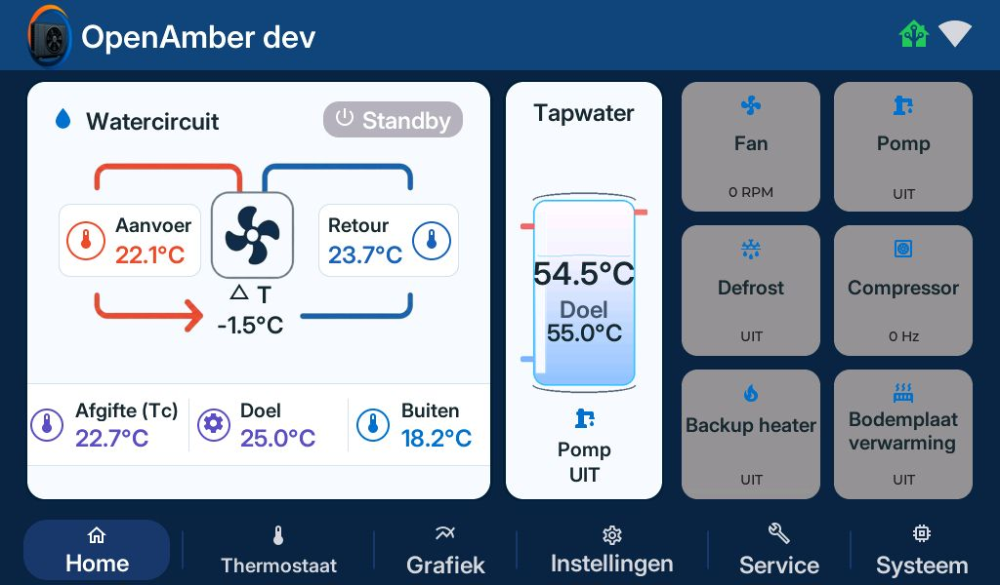
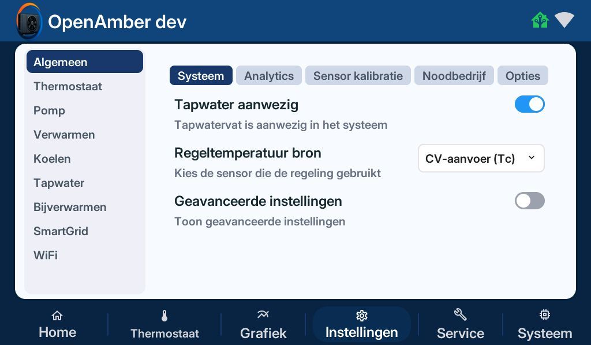
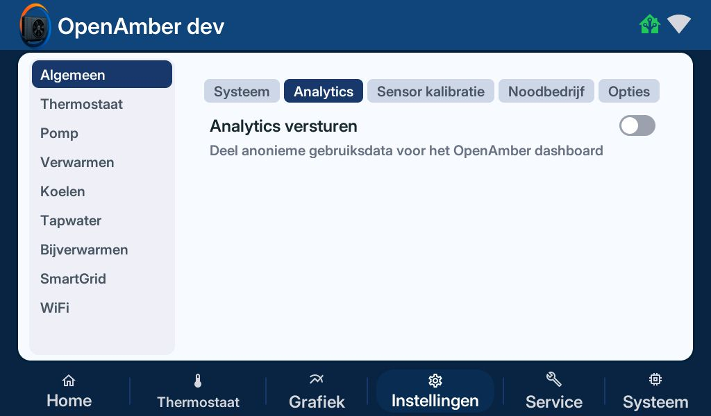
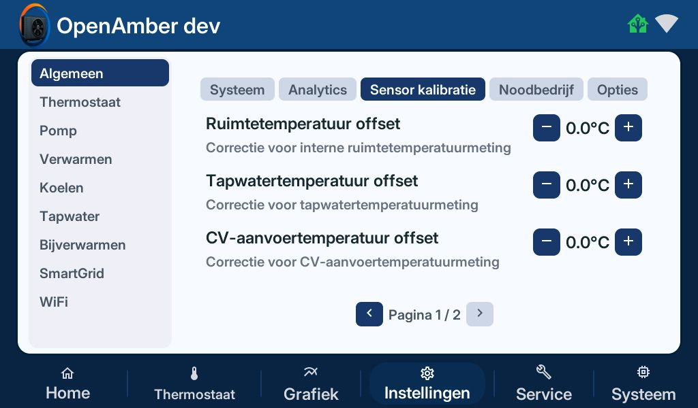
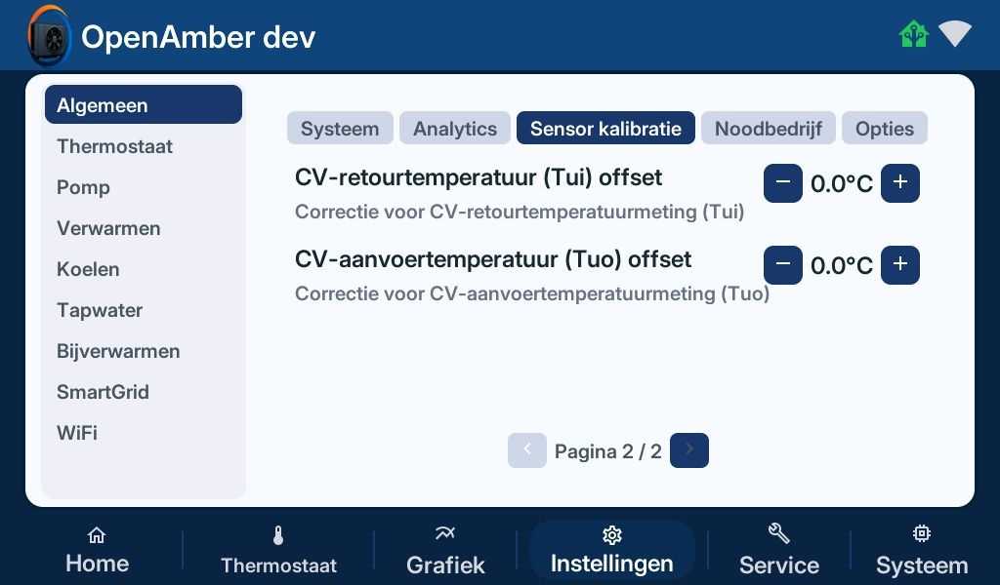
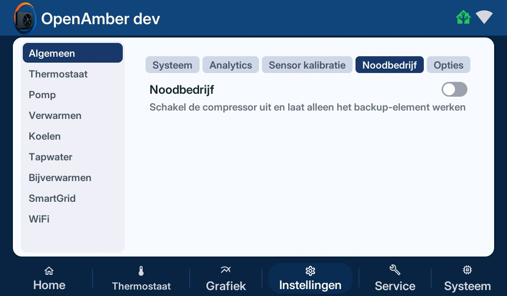
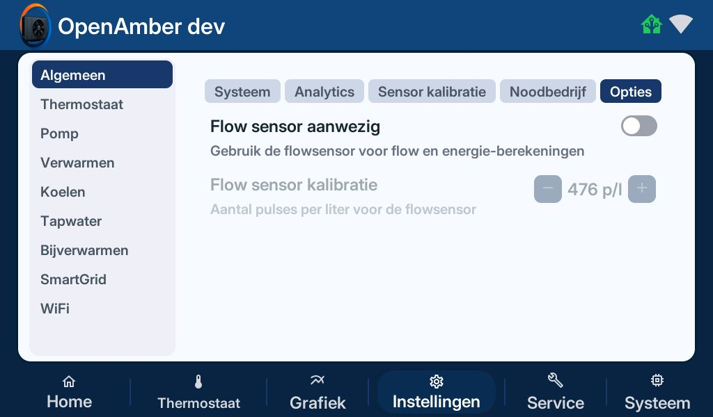
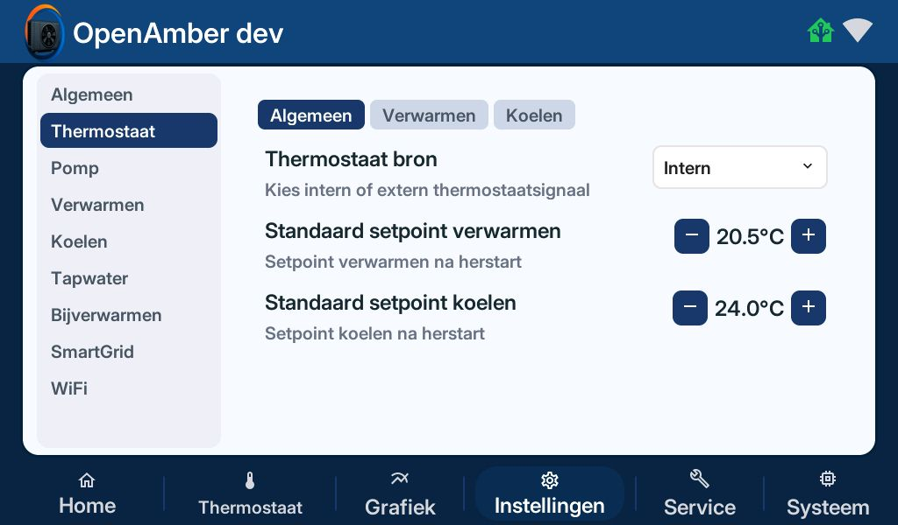
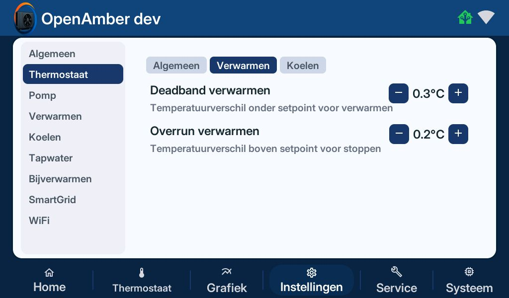
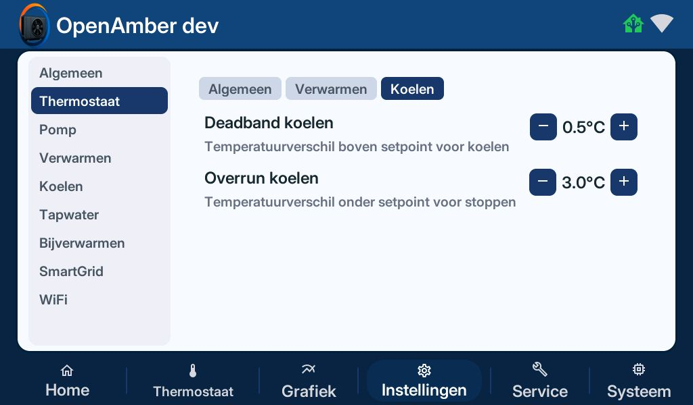

# OpenAmber  -  Instellingsoverzicht

**Versie:** 0.6.0 (dev)

## Menustructuur

### Hoofdmenu

[Home](#home) | [Thermostaat](#thermostaat) | Grafiek | [Instellingen](#instellingen) | [Service](#service) | [Systeem](#systeem)

#### Home

#### Thermostaat

#### Grafiek

#### Instellingen

[Algemeen](#algemeen---systeem) | [Thermostaat](#thermostaat) | [Pomp](#pomp) | [Verwarmen](#verwarmen) | [Koelen](#koelen) | [Tapwater](#tapwater) | [Bijverwarmen](#bijverwarmen) | [SmartGrid](#smartgrid) | [WiFi](#wifi)

#### Service

[Algemeen](#service--algemeen) | [Buitenunit](#service--buitenunit-geavanceerd) | [Pompen](#service--pompen-geavanceerd) | [3-weg klep](#service--3-weg-klep-geavanceerd) | [Back-up](#service--back-up-geavanceerd) | [EEPROM](#service--eeprom) | [Sensoren](#service--sensoren) | [Foutmeldingen](#service--foutmeldingen) | [Waarschuwingen](#service--waarschuwingen)

#### Systeem

[Beheer](#systeem---beheer) | [Diagnostiek](#systeem---diagnostiek)

## Instellingen

### Algemeen

#### Algemeen - Systeem

| **Instelling** | **Opties** | **Standaard** | **Beschrijving** |
| :-: | :-: | :-: | :-: |
| Tapwater aanwezig | Aan / Uit | Uit | Tapwatervat is aanwezig in het systeem |
| Regeltemperatuur bron | CV-aanvoer (Tc) / CV-aanvoer zone 1 (Tv1) | CV-aanvoer (Tc) | Kies de sensor die de regeling gebruikt |
| Geavanceerde instellingen | Aan / Uit | Uit | Toon geavanceerde instellingen |

### Algemeen - Analytics

| **Instelling** | **Opties** | **Standaard** | **Beschrijving** |
| :-: | :-: | :-: | :-: |
| Analytics versturen | Aan / Uit | Uit | Deel anonieme gebruiksdata voor het OpenAmber dashboard |

### Algemeen - Sensor Kalibratie

| **Instelling** | **Opties** | **Standaard** | **Beschrijving** |
| :-: | :-: | :-: | :-: |
| Ruimtetemperatuur offset | -5.0 t/m +5.0°C (stap 0.1) | 0.0°C | Correctie voor interne ruimtetemperatuurmeting |
| Tapwatertemperatuur offset | -5.0 t/m +5.0°C (stap 0.1) | 0.0°C | Correctie voor tapwatertemperatuurmeting |
| CV-aanvoertemperatuur offset | -5.0 t/m +5.0°C (stap 0.1) | 0.0°C | Correctie voor CV-aanvoertemperatuurmeting |
| CV-retourtemperatuur (Tui) offset | -5.0 t/m +5.0°C (stap 0.1) | 0.0°C | Correctie voor CV-retourtemperatuurmeting (Tui) |
| CV-aanvoertemperatuur (Tuo) offset | -5.0 t/m +5.0°C (stap 0.1) | 0.0°C | Correctie voor CV-aanvoertemperatuurmeting (Tuo) |

### Algemeen - Noodbedrijf

| **Instelling** | **Opties** | **Standaard** | **Beschrijving** |
| :-: | :-: | :-: | :-: |
| Noodbedrijf | Aan / Uit | Uit |  |

### Algemeen - Opties

| **Instelling** | **Opties** | **Standaard** | **Beschrijving** |
| :-: | :-: | :-: | :-: |
| Flow sensor aanwezig | Aan / Uit | Uit | Gebruik de flowsensor voor flow en energie-berekeningen |
| Flow sensor kalibratie | 1 t/m 1000 | 476 p/l | Aantal pulses per liter voor de flowsensor |

### Thermostaat

#### Thermostaat - Algemeen

| **Instelling** | **Opties** | **Standaard** | **Beschrijving** |
| :-: | :-: | :-: | :-: |
| Thermostaat bron | Intern / Extern | Extern | Kies intern of extern thermostaatsignaal |
| Standaard setpoint verwarmen | 10.0 t/m 30.0°C (stap 0.1) | 20.5°C | Setpoint verwarmen na herstart |
| Standaard setpoint koelen | 18.0 t/m 30.0°C (stap 0.1) | 24.0°C | Setpoint koelen na herstart |

#### Thermostaat - Verwarmen

| **Instelling** | **Opties** | **Standaard** | **Beschrijving** |
| :-: | :-: | :-: | :-: |
| Deadband verwarmen | 0.1 t/m 5.0°C (stap 0.1) | 0.3°C | Temperatuurverschil onder setpoint voor verwarmen |
| Overrun verwarmen | 0.1 t/m 5.0°C (stap 0.1) | 0.2°C | Temperatuurverschil boven setpoint voor stoppen |

#### Thermostaat - Koelen

| **Instelling** | **Opties** | **Standaard** | **Beschrijving** |
| :-: | :-: | :-: | :-: |
| Deadband koelen | 0.1 t/m 5.0°C (stap 0.1) | 0.5°C | Temperatuurverschil boven setpoint voor koelen |
| Overrun koelen | 0.1 t/m 10.0°C (stap 0.1) | 3.0°C | Temperatuurverschil onder setpoint voor stoppen |

### Pomp

#### Pomp - Algemeen

| **Instelling** | **Opties** | **Standaard** | **Beschrijving** |
| :-: | :-: | :-: | :-: |
| Pomp P1 aanwezig | Aan / Uit | Uit | Extra circulatiepomp P1 aanwezig |
| Pompinterval | 5 t/m 60 min | 15 min | Tussentijd periodiek pompen bij warmte-/koudevraag |
| Pompduur | 2 t/m 10 min | 2 min | Draaitijd bij periodiek pompen |
| Flow switch uitvalvertraging | 0 t/m 10 min | 0 min | Stop bij geen flow na ingesteld aantal minuten |

#### Pomp - Pompsnelheid

| **Instelling** | **Opties** | **Standaard** | **Beschrijving** |
| :-: | :-: | :-: | :-: |
| Pompsnelheid verwarmen | 0 t/m 100% | 100% | Pompsnelheid tijdens verwarmen |
| Pompsnelheid koelen | 0 t/m 100% | 100% | Pompsnelheid tijdens koelen |
| Pompsnelheid tapwater | 0 t/m 100% | 100% | Pompsnelheid tijdens het verwarmen van tapwater |

#### Pomp - Dynamisch PWM P0

| **Instelling** | **Opties** | **Standaard** | **Beschrijving** |
| :-: | :-: | :-: | :-: |
| Pomp P0 Dynamisch PWM (Verwarmen) | Aan / Uit | Uit | Regel P0 op basis van delta-T tijdens verwarmen |
| Gewenste delta-T | 2.0 t/m 10.0°C (stap 0.1) | 3.0°C | Doelwaarde voor Tuo – Tui tijdens verwarmen |
| Minimale pomp PWM | 20 t/m 100% | 70% | Ondergrens voor automatische P0-regeling |
| Maximale pomp PWM | 20 t/m 100% | 100% | Bovengrens voor automatische P0-regeling |

#### Pomp - Vorstbeschermer

| **Instelling** | **Opties** | **Standaard** | **Beschrijving** |
| :-: | :-: | :-: | :-: |
| Buitentemperatuur 1e trap | 0.0 t/m 10.0°C (stap 0.1) | 5.0°C | Buitentemperatuur waaronder trap 1 activeert |
| Buitentemperatuur 2e trap | 0.0 t/m 10.0°C (stap 0.1) | 4.0°C | Buitentemperatuur waaronder trap 2 activeert |
| Watertemperatuur 2e trap | 0.0 t/m 10.0°C (stap 0.1) | 7.0°C | Watertemperatuur waaronder trap 2 activeert |

### Verwarmen

#### Verwarmen – Algemeen

| **Instelling** | **Opties** | **Standaard** | **Beschrijving** |
| :-: | :-: | :-: | :-: |
| Verwarmingsmodus | Stooklijn / Extern setpoint | Stooklijn | Kies stooklijn of extern aangestuurd setpoint |
| Extern setpoint | 15 t/m 45°C | 30°C | CV-aanvoertemperatuur bij extern setpoint |
| Verwarmen vermogen | Beperkt / Zeer laag / Laag / Gemiddeld / Verhoogd / Hoog / Maximaal | Maximaal | Max compressorvermogen bij verwarmen |

#### Verwarmen – Stooklijnen

| **Buitentemperatuur** | **-10°C** | **0°C** | **+5°C** | **+10°C** | **+15°C** |
| :-: | :-: | :-: | :-: | :-: | :-: |
| CV-setpoint | 35°C | 30°C | 28°C | 27°C | 25°C |
| Bereik | 15–45°C | 15–45°C | 15–45°C | 15–45°C | 15–45°C |

#### Verwarmen – Start/Stop

| **Instelling** | **Opties** | **Standaard** | **Beschrijving** |
| :-: | :-: | :-: | :-: |
| Start delta | 0.1 t/m 10.0°C (stap 0.1) | 3.0°C | Verschil met setpoint om compressor te starten |
| Stop delta | 0.1 t/m 10.0°C (stap 0.1) | 5.0°C | Verschil met setpoint om compressor te stoppen |

#### Verwarmen – PID (Geavanceerd)

| **Instelling** | **Opties** | **Standaard** | **Beschrijving** |
| :-: | :-: | :-: | :-: |
| Kp | 0.00 t/m 3.00 (stap 0.01) | 0.60 | Proportionele versterking |
| Ki | 0.0000 t/m 0.0500 (stap 0.0001) | 0.0020 | Integrale versterking |
| Kd | 0.00 t/m 25.00 (stap 0.01) | 0.70 | Differentiële versterking |
| Deadband | 0.0 t/m 5.0°C (stap 0.1) | 1.0°C | Temperatuurzone waarbinnen PID inactief is |

### Koelen

#### Koelen – Algemeen

| **Instelling** | **Opties** | **Standaard** | **Beschrijving** |
| :-: | :-: | :-: | :-: |
| Koelen vermogen | Beperkt / Zeer laag / Laag / Gemiddeld / Verhoogd / Hoog / Maximaal | Maximaal | Max compressorvermogen bij koelen |
| Start delta | 0.1 t/m 10.0°C (stap 0.1) | 3.0°C | Verschil met setpoint om compressor te starten tijdens koelen |
| Stop delta | 0.1 t/m 10.0°C (stap 0.1) | 5.0°C | Verschil met setpoint om compressor te stoppen tijdens koelen |

#### Koelen – Setpoint

| **Instelling** | **Opties** | **Standaard** | **Beschrijving** |
| :-: | :-: | :-: | :-: |
| Koelmodus | Intern setpoint / Extern setpoint | Intern setpoint | Kies intern of extern setpoint |
| Setpoint | 5 t/m 25°C | 7°C | Doeltemperatuur voor koelen |
| Extern setpoint | - | 30°C | Koelsetpoint bij extern setpoint |

### Tapwater

#### Tapwater - Algemeen

| **Instelling** | **Opties** | **Standaard** | **Beschrijving** |
| :-: | :-: | :-: | :-: |
| Setpoint | 25 t/m 75°C | 55°C | Gewenste tapwatertemperatuur |
| Herstart delta | 5 t/m 25°C | 15°C | Temperatuurdaling waarna verwarming herstart |
| Basisvermogen | Beperkt / Zeer laag / Laag / Gemiddeld / Verhoogd / Hoog / Maximaal | Beperkt | Compressorvermogen in normale modus |
| Tapwaterpomp startmodus | Aanvoer warmer dan vat (ΔT) / Samen met compressor | Aanvoer warmer dan vat (ΔT) | Wanneer de tapwaterpomp start |

#### Tapwater – Winter

| **Instelling** | **Opties** | **Standaard** | **Beschrijving** |
| :-: | :-: | :-: | :-: |
| Wintervermogen | Gemiddeld / Verhoogd / Hoog / Maximaal | Gemiddeld | Max compressorvermogen in wintermodus |
| Wintertemperatuurdrempel | -20 t/m 10°C | 5°C | Buitentemperatuur waaronder wintermodus actief |

#### Tapwater – Schema

| **Instelling** | **Opties** | **Standaard** | **Beschrijving** |
| :-: | :-: | :-: | :-: |
| Tapwater schema | Aan / Uit | Uit | Verwarming alleen op geplande tijden |
| Maandag t/m Zondag | Aan / Uit | Uit | Schema per dag in- of uitschakelen |

#### Tapwater - Legionella

| **Instelling** | **Opties** | **Standaard** | **Beschrijving** |
| :-: | :-: | :-: | :-: |
| Legionellapreventie | Aan / Uit | Uit | Periodieke opwarming tegen legionella |
| Legionella herhaling | 7 t/m 60 d | 7 d | Dagen tussen preventieverwarming |
| Legionella doeltemperatuur | 55 t/m 65°C | 60°C | Doeltemperatuur bij preventiecyclus |

### Bijverwarmen

#### Bijverwarmen – Algemeen

| **Instelling** | **Opties** | **Standaard** | **Beschrijving** |
| :-: | :-: | :-: | :-: |
| Backup element | Intern verwarmingselement / Externe backup verwarming | Intern verwarmingselement | Extern is voor hybride opstelling |
| Boosttemperatuur voor backup bij ontdooien | -15 t/m 15°C | -3°C | Buitentemperatuur waaronder backup activeert bij ontdooien |

#### Bijverwarmen – Verwarmen

| **Instelling** | **Opties** | **Standaard** | **Beschrijving** |
| :-: | :-: | :-: | :-: |
| Backup °min drempel | 0 t/m 100 °C·min (stap 5) | 40 °C·min | Graadminuten drempel voor backup element tijdens verwarmen |

#### Bijverwarmen - Tapwater

| **Instelling** | **Opties** | **Standaard** | **Beschrijving** |
| :-: | :-: | :-: | :-: |
| Min. verwarmingssnelheid | 0.00 t/m 5.00 °C/min (stap 0.01) | 0.12 °C/min | Minimale tapwaterverwarmsnelheid; lager schakelt backup in |
| Backupvertraging | 0 t/m 60 min | 5 min | Tijd onder minimale verwarmsnelheid voordat backup inschakelt |

#### SmartGrid

| **Instelling** | **Opties** | **Standaard** | **Beschrijving** |
| :-: | :-: | :-: | :-: |
| Verwarmingsboost | 0 t/m 10°C | 5°C | Extra temperatuur verwarming bij SG boost |
| Tapwater boost | 0 t/m 25°C | 5°C | Extra temperatuur tapwater bij SG boost |

#### WiFi

#### Geavanceerd

#### Geavanceerd - Verwarmen PID

#### Pomp - P0 PID (Geavanceerd)

| **Instelling** | **Opties** | **Standaard** | **Beschrijving** |
| :-: | :-: | :-: | :-: |
| PID P (Kp) |  | 0.60 | Hoger: sneller reageren, lager: rustiger maar trager |
| PID I (Ki) |  | 0.0015 | Hoger: corrigeert afwijking sneller, lager: minde aggressief |
| PID D (Kd) |  | 0.70 | Hoger: dempt schommelingen, lager: direct maar ongunstiger |
| PID deadband (+/-) |  | 1.0°C | Zone rond setpoint waarin PID-output minder wijzigt |

#### Geavanceerd - Koelen PID

| **Instelling** | **Opties** | **Standaard** | **Beschrijving** |
| :-: | :-: | :-: | :-: |
| PID P (Kp) |  | 0.60 | Hoger: sneller reageren, lager: rustiger maar trager |
| PID I (Ki) |  | 0.0020 | Hoger: corrigeert afwijking sneller, lager: minde aggressief |
| PID D (Kd) |  | 0.70 | Hoger: dempt schommelingen, lager: direct maar ongunstiger |
| PID deadband (+/-) |  | 1.0°C | Zone rond setpoint waarin PID-output minder wijzigt |

#### Geavanceerd – Bodemplaat

| **Instelling** | **Opties** | **Standaard** | **Beschrijving** |
| :-: | :-: | :-: | :-: |
| Bodemplaat | Onbekend / Buitentemperatuur Tijdens defrost | Tijdens defrost | Kies wanneer actief |
| Starttemperatuur bodemplaat |  | Fabriekswaarde | Buitentemperatuur voor inschakelen bodemplaat |
| Stop-hysterese bodemplaat |  | Fabriekswaarde | Hysterese voor uitschakelen bodemplaat |

#### Geavanceerd – Defrost

| **Instelling** | **Opties** | **Standaard** | **Beschrijving** |
| :-: | :-: | :-: | :-: |
| Exit defrost temperatuur |  | 17°C | Defrost stoptemperatuur |
| Maximale ontdooitijd |  | 8 min | Maximum duur van een defrost-cyclus |
| Defrost starttemperatuur 1 |  | Fabriekswaarde |  |
| Defrost starttemperatuur 2 |  | Fabriekswaarde |  |
| Defrost starttemperatuur 3 |  | Fabriekswaarde |  |
| Defrost starttemperatuur 4 |  | Fabriekswaarde |  |

## Service

### Service – Algemeen

| **Instelling** | **Opties** | **Standaard** | **Beschrijving** |
| :-: | :-: | :-: | :-: |
| Onderhoudsmodus | Aan / Uit | Uit | Handmatige bediening blijft vergrendeld tot onderhoudsmodus actief is |
| Ontluchten | Kort (~10 min) / Uitgebreid (~31 min) | Inactief | Automatische ontluchtingsroutine |

### Service – Buitenunit (Geavanceerd)

| **Instelling** | **Opties** | **Standaard** | **Beschrijving** |
| :-: | :-: | :-: | :-: |
| Ventilator RPM | 0 t/m 1000 | 0 | Handmatige ventilatorsnelheid |
| Carterverwarming | Aan / Uit | Uit | Schakelt carterverwarming |
| Bodemplaat verwarming | Aan / Uit | Uit | Schakelt bodemplaatverwarming |

### Service – Pompen (Geavanceerd)

| **Instelling** | **Opties** | **Standaard** | **Beschrijving** |
| :-: | :-: | :-: | :-: |
| P0 pomp relais | Aan / Uit | Uit | Schakel P0 pomp |
| P0 PWM | 0 t/m 100% | 0% | P0 pomp PWM waarde |
| P1 pomp relais | Aan / Uit | Uit | Schakel P1 pomp relais |
| P2 pomp relais | Aan / Uit | Uit | Schakel P2 pomp relais |
| SWW pomp relais | Aan / Uit | Uit | Schakel SWW pomp relais |

### Service – 3-weg klep (Geavanceerd)

| **Instelling** | **Opties** | **Standaard** | **Beschrijving** |
| :-: | :-: | :-: | :-: |
| Klepstand forceren | CV/Koelen / Tapwater | CV/Koelen | Forceer de 3-weg klep tijdelijk naar CV/Koelen of Tapwater |

### Service – Back-up (Geavanceerd)

| **Instelling** | **Opties** | **Standaard** | **Beschrijving** |
| :-: | :-: | :-: | :-: |
| Backup element | Aan / Uit | Uit | Schakel elektrisch backup element |
| CV hybride backup relais | Aan / Uit | Uit | Schakel hybride backup relais |

### Service – EEPROM

| **Instelling** | **Beschrijving** | **Type** |
| :-: | :-: | :-: |
| Dump EEPROM | Verzend EEPROM parameters naar OpenAmber Analytics | Alleen lezen |

### Service – Sensoren

#### Status

| **Sensor** | **Waarde** |
| :-: | :-: |
| Status | Idle |
| Hoofdstatus | Heat/Cool |
| CV/Koelen | Idle |
| Tapwater | Idle |

#### Druk & Temperatuur

| **Sensor** | **Waardes** |
| :-: | :-: |
| Ta / Tc |  |
| Tuo / Tui |  |
| Zuig / Pers |  |

#### Aansturing

| **Sensor** | **Waardes** |
| :-: | :-: |
| Compressor | 0 - 60 Hz |
| Pomp PWM | 0 - 100% |
| Fan RPM | 0 - 1000 |
| Expansieklep | 0 - 200% |

#### Systeem

| **Sensor** | **Waarde** |
| :-: | :-: |
| Defrost / Bodemplaat | Heat/Cool |
| Modbus binnen | Online/Offline |
| Modbus buiten | Online/Offline |
| SG contacten A / B | UIT/AAN / UIT/AAN |
| Warmte/koude vraag | UIT/AAN / UIT/AAN |

### Service – Foutmeldingen

| **Status** | **Bericht** |
| :-: | :-: |
| Actieve foutmeldingen | "Geen actieve foutmeldingen" (standaard) |

### Service – Waarschuwingen

| **Status** | **Bericht** |
| :-: | :-: |
| Actieve waarschuwingen | "Geen actieve waarschuwingen" (standaard) |

## Systeem

### Systeem - Beheer

| **Instelling** | **Opties** | **Beschrijving** |
| :-: | :-: | :-: |
| Software versie | 0.6.0 (dev) | Huidige versie |
| Controleer updates | Button | Handmatige updatecontrole |
| Update | Button | Voer software-update uit |
| Herstarten | Button | Systeemherstart |
| QR-code | Scan voor release info | Link naar release informatie |

### Systeem - Diagnostiek
